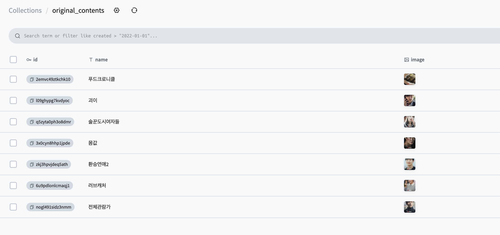
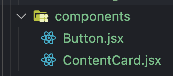
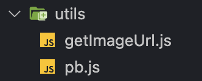
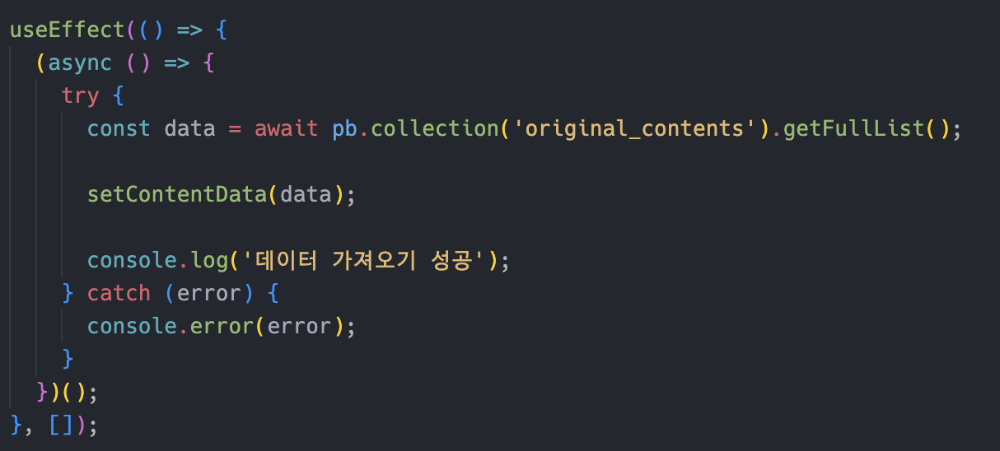
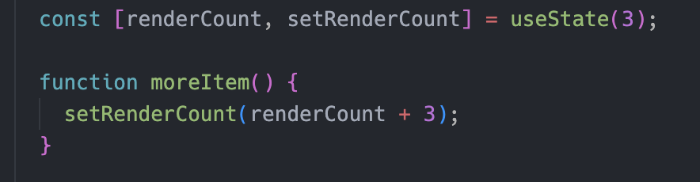
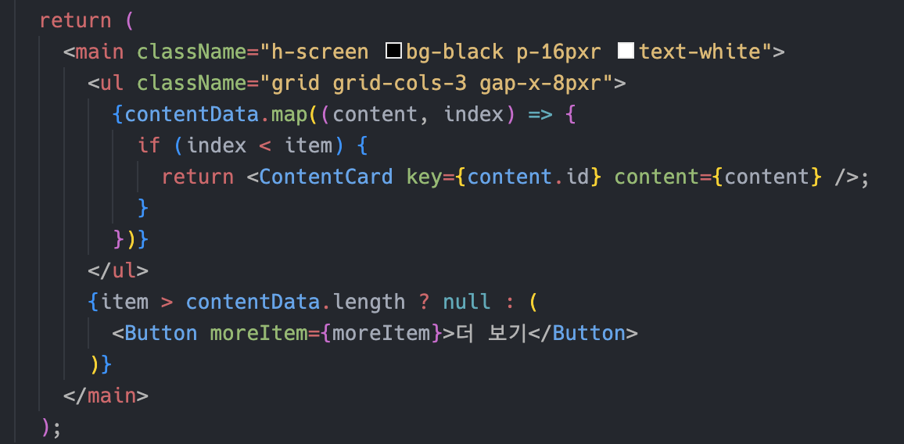

# React Homework2

## 바닐라 프로젝트의 동적 렌더링 UI를 리액트로 구현해보자

### 타잉 시안에서 동적 렌더링을 잘 보여줄 수 있는 부분이 별로 없는 것 같아서 타잉 데이터로 간단한 '더보기' UI를 구현해보았다.

### data source(프로젝트 때 사용했던 pockethost의 original_contents 컬렉션)

> 

- 데이터를 json파일로 받지 않고 pocketbase api를 이용해서 바로 받아옴

### 아토믹 디자인

- contents list를 3개씩 나눠서 버튼 클릭 시 렌더링 시킬것임
- Button, ContentCard(`<li></li>`)는 컴포넌트화
  

### util함수

- 포켓베이스 api를 반환하는 'pb.js'
- 데이터 베이스에서 이미지 url을 받아오는 'getImageUrl.js'
  

### 작동 흐름

1. 데이터 베이스 original_contents 컬렉션의 데이터를 받아와서 변수에 저장.
   

   - 컴포넌트가 최초 렌더링 될 때 한 번만 통신
   - 로딩중엔 '로딩중...' 메시지 출력

2. 받아온 데이터를 3개씩 렌더링(레이아웃은 grid로 스타일링 함)
   >  
   - 한 번에 렌더링 되는 카드 수를 renderCount로 상태관리
   - '더보기' 버튼 클릭 시 카드 3개씩 추가로 렌더링
   - renderCount가 contentData.length보다 커지면 '더보기'버튼 삭제

### 생각해볼 점

- 라이프 사이클의 적절한 사용(올바르게 사용했나?)
- 아토믹 디자인을 잘 적용했는가
